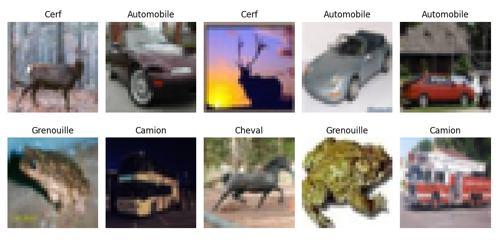
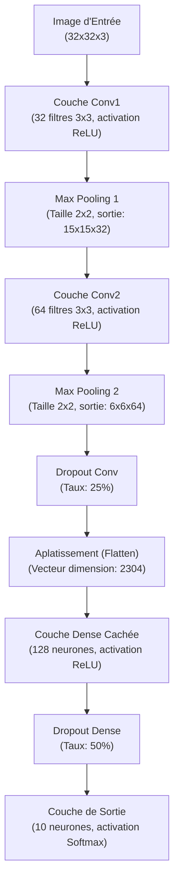
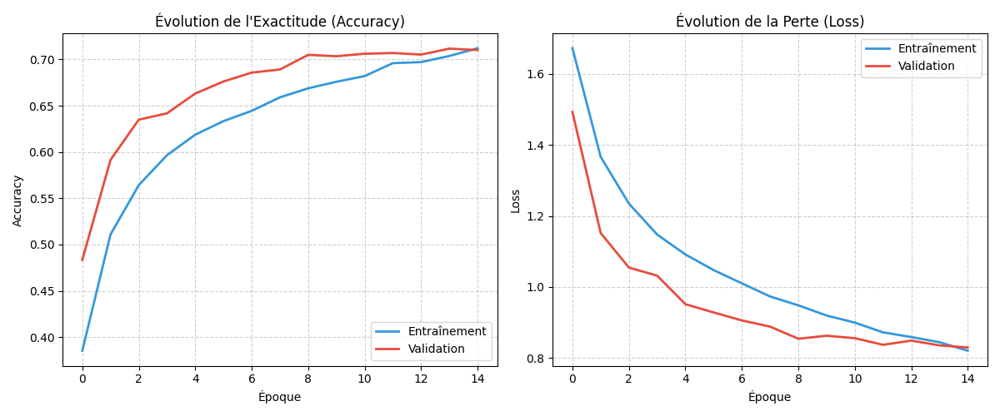
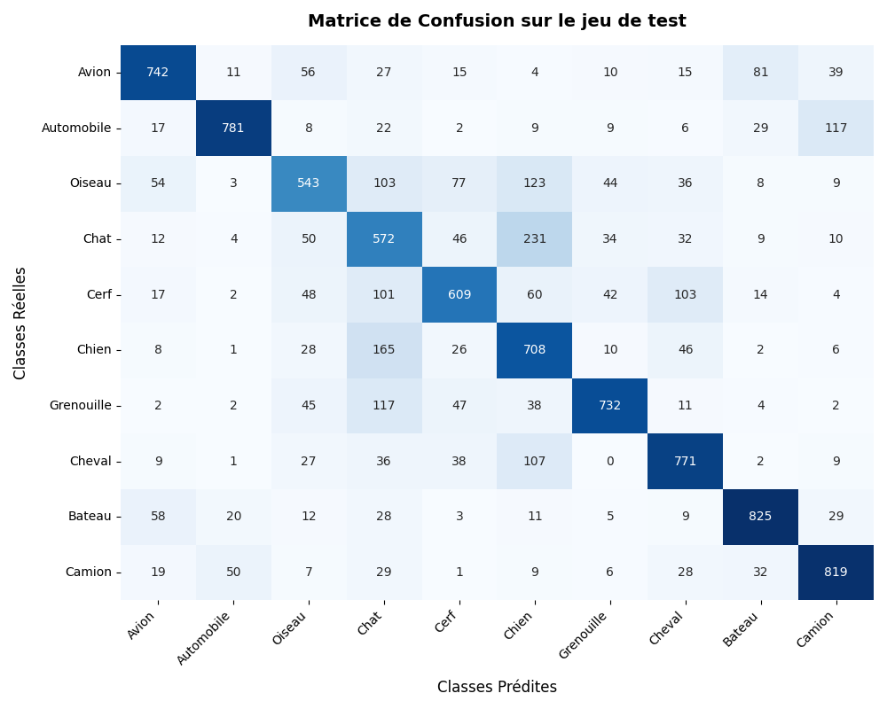
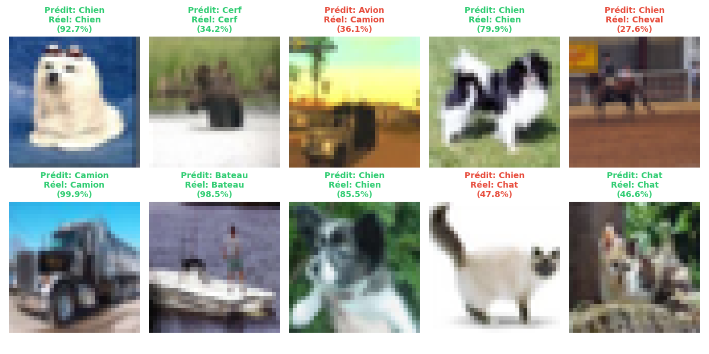

# Rapport de Travaux Pratiques
## Intelligence Artificielle & Vision par Ordinateur : Classification d'Images (CIFAR-10) avec un Réseau de Neurones Convolutif (CNN)

---

### **Informations Générales**
*   **Matière :** Intelligence Artificielle & Deep Learning (Python)
*   **Sujet du TP :** Classification de la base d'images CIFAR-10 à l'aide d'un réseau de neurones convolutif
*   **Technologie :** TensorFlow / Keras, NumPy, Scikit-Learn, Matplotlib, Seaborn
*   **Auteur :** Antigravity & Hamza
*   **Date :** Mai 2026

---

## **Table des Matières**
1. [Introduction & Contexte](#1-introduction--contexte)
2. [Outils Technologiques et Bibliothèques Utilisés](#2-outils-technologiques-et-bibliothèques-utilisés)
3. [Exploration et Présentation du Dataset CIFAR-10](#3-exploration-et-présentation-du-dataset-cifar-10)
4. [Prétraitement des Données (Preprocessing)](#4-prétraitement-des-données-preprocessing)
5. [Architecture du Réseau de Neurones Convolutif (CNN)](#5-architecture-du-réseau-de-neurones-convolutif-cnn)
6. [Compilation et Configuration de l'Entraînement](#6-compilation-et-configuration-de-lentraînement)
7. [Résultats de l'Entraînement et de l'Évaluation (Test)](#7-résultats-de-lentraînement-et-de-lévaluation-test)
   - 7.1 [Courbes de Perte (Loss) et d'Exactitude (Accuracy)](#71-courbes-de-perte-loss-et-dexactitude-accuracy)
   - 7.2 [Évaluation sur le Jeu de Test](#72-évaluation-sur-le-jeu-de-test)
   - 7.3 [Analyse de la Matrice de Confusion](#73-analyse-de-la-matrice-de-confusion)
   - 7.4 [Rapport de Classification Textuel](#74-rapport-de-classification-textuel)
   - 7.5 [Analyse Visuelle des Prédictions du Modèle](#75-analyse-visuelle-des-prédictions-du-modèle)
8. [Analyse du Sur-apprentissage (Overfitting) & Rôle du Dropout](#8-analyse-du-sur-apprentissage-overfitting--rôle-du-dropout)
9. [Perspectives et Améliorations Possibles](#9-perspectives-et-améliorations-possibles)
10. [Conclusion](#10-conclusion)

---

### **1. Introduction & Contexte**
La classification automatique d'images est un problème historique de la **Vision par Ordinateur (Computer Vision)**. Jusqu'aux années 2010, l'extraction de caractéristiques géométriques ou texturales d'une image reposait sur des descripteurs conçus manuellement (tels que SIFT ou HOG), suivis de classificateurs classiques (SVM, Random Forest). Cette approche montrait de fortes limites face aux variations de lumière, d'échelle et d'orientation.

L'avènement du **Deep Learning** et des **Réseaux de Neurones Convolutifs (CNN - Convolutional Neural Networks)** a radicalement changé la donne. Les CNN apprennent de manière hiérarchique et automatisée les représentations adaptées aux données d'entrée. 
- Les premières couches extraisent des motifs simples (bords, contours, textures de base).
- Les couches intermédiaires assemblent ces motifs en formes géométriques.
- Les couches profondes capturent des concepts sémantiques (yeux, roues, visages).

Ce TP illustre la mise en œuvre pratique d'un CNN pour classifier des images en couleur dans l'un des jeux de données d'apprentissage les plus emblématiques de la littérature : **CIFAR-10**.

---

### **2. Outils Technologiques et Bibliothèques Utilisés**
Le développement du projet s'appuie sur un écosystème Python moderne dédié à la science des données et au Deep Learning :

1.  **TensorFlow & Keras (v2.x/v3.x)** :
    *   *TensorFlow* est la plateforme open source de Google pour l'apprentissage automatique.
    *   *Keras* est son API de haut niveau, conçue pour être modulaire, conviviale et rapide à prototyper. Elle permet d'empiler des couches de neurones, d'associer des fonctions de perte et des optimisateurs, et de lancer l'entraînement en quelques lignes.
2.  **NumPy** :
    *   Bibliothèque fondamentale pour le calcul scientifique en Python. Elle permet de gérer les images d'entrée sous forme de matrices multidimensionnelles (tenseurs) et de réaliser des opérations arithmétiques vectorisées rapides (comme la normalisation par division).
3.  **Matplotlib (Pyplot)** :
    *   Utilisé pour l'affichage visuel des résultats. C'est l'outil qui génère la grille d'exemples d'images, trace les courbes de convergence (Loss / Accuracy) au fil des époques, et affiche la grille finale des prédictions.
4.  **Seaborn** :
    *   Construite sur Matplotlib, cette bibliothèque de visualisation statistique est exploitée ici pour dessiner une matrice de confusion élégante sous forme de carte thermique (Heatmap) de couleur bleue, rendant la lecture des erreurs intuitive.
5.  **Scikit-Learn (Sklearn)** :
    *   Le module `sklearn.metrics` est utilisé pour calculer la matrice de confusion (`confusion_matrix`) et générer le rapport textuel de classification (`classification_report`) incluant la précision, le rappel et le F1-score pour chaque classe.

---

### **3. Exploration et Présentation du Dataset CIFAR-10**
Le jeu de données **CIFAR-10** (Canadian Institute for Advanced Research) regroupe 60 000 images couleur de petite taille, uniformément réparties entre 10 classes d'objets du quotidien.

*   **Structure globale :**
    *   **50 000 images** dédiées à la phase d'entraînement.
    *   **10 000 images** dédiées à la phase d'évaluation (jeu de test).
*   **Caractéristiques des images :**
    *   **Résolution spatiale :** $32 \times 32$ pixels.
    *   **Canaux de couleur :** 3 canaux (Rouge, Vert, Bleu - RGB).
    *   **Représentation matricielle :** Chaque image est encodée sous la forme d'un tenseur de dimensions $(32, 32, 3)$, contenant $3 \times 32 \times 32 = 3072$ valeurs d'intensité comprises entre 0 et 255.
*   **Les 10 classes cibles :**
    1. `Avion` (0) | 2. `Automobile` (1) | 3. `Oiseau` (2) | 4. `Chat` (3) | 5. `Cerf` (4)
    6. `Chien` (5) | 7. `Grenouille` (6) | 8. `Cheval` (7) | 9. `Bateau` (8) | 10. `Camion` (9)

> [!NOTE]
> La faible résolution des images rend le dataset extrêmement adapté pour des TP de Deep Learning car l'entraînement peut être complété en quelques minutes sur un processeur standard (CPU) ou une petite carte graphique (GPU), tout en posant des défis réels de classification en raison du flou et de la ressemblance entre certaines classes.

Voici un échantillon d'images tirées aléatoirement du dataset :

---

### **4. Prétraitement des Données (Preprocessing)**
Pour optimiser les performances et la stabilité mathématique du réseau convolutif, les étapes suivantes sont indispensables :

1.  **Mise en forme des dimensions (Squeeze) :**
    Les étiquettes (labels) originales possèdent une forme bidimensionnelle de type $(N, 1)$. Afin de faciliter la compatibilité avec les fonctions de perte Keras et d'éviter les erreurs de forme, nous utilisons `y_train.squeeze()` pour aplatir ces vecteurs en dimensions simples de type $(N,)$.
2.  **Normalisation des Pixels (Min-Max Scaling) :**
    Les valeurs initiales des pixels varient entre 0 (intensité nulle) et 255 (intensité maximale). Si nous alimentons le réseau directement avec ces valeurs brutes :
    *   Les fonctions d'activation (telles que ReLU ou Sigmoïd) risquent de saturer.
    *   Les gradients calculés pendant la rétropropagation peuvent devenir instables ou disproportionnés, ralentissant considérablement la convergence.
    
    Pour y remédier, nous convertissons les matrices d'images en réels de type `float32` et divisons chaque valeur par `255.0` :
    $$X_{normalisé} = \frac{X_{brut}}{255.0}$$
    Les valeurs sont ainsi projetées dans l'intervalle $[0.0, 1.0]$.

---

### **5. Architecture du Réseau de Neurones Convolutif (CNN)**
Le réseau conçu dans le cadre de ce TP adopte une structure séquentielle (les couches s'empilent linéairement) composée de deux blocs d'extraction de caractéristiques spatiales suivis d'un bloc de classification finale.

#### **Diagramme de flux de données**

#### **Détail et Justification des Couches :**
*   **Couche de Convolution 2D (`Conv1` & `Conv2`)** :
    Chaque filtre convolutif glisse (fait une corrélation croisée) sur l'image pour extraire une carte d'activation (Feature Map).
    *   `Conv1` applique 32 filtres de taille $3 \times 3$.
    *   `Conv2` applique 64 filtres de taille $3 \times 3$.
    L'activation utilisée est la fonction linéaire rectifiée **ReLU** : $f(x) = \max(0, x)$. Elle résout le problème de disparition du gradient (vanishing gradient) et introduit la non-linéarité nécessaire pour apprendre des structures non linéaires complexes.
*   **Couche de Max Pooling 2D (`MaxPool1` & `MaxPool2`)** :
    Elles réduisent de moitié les dimensions spatiales de l'image (hauteur et largeur) en ne conservant que la valeur maximale dans chaque fenêtre glissante de $2 \times 2$.
    *   *Avantage 1 :* Diminue le nombre de paramètres libres dans les couches suivantes, accélérant les calculs et réduisant l'empreinte mémoire.
    *   *Avantage 2 :* Apporte une invariance locale par translation (le réseau reconnaît un motif même s'il s'est légèrement déplacé).
*   **Couches de Dropout (`Dropout_Conv` - 25% & `Dropout_Dense` - 50%)** :
    Désactivent aléatoirement un pourcentage défini de neurones à chaque cycle de rétropropagation. Cette technique empêche les neurones de co-dépendre excessivement les uns des autres et force le réseau à apprendre des représentations alternatives et plus robustes. Elle constitue une arme redoutable contre le sur-apprentissage.
*   **Aplatissement (`Flatten`)** :
    Cette couche n'apprend rien. Elle se contente de réorgan le tenseur spatial de sortie de la convolution ($6 \times 6 \times 64$) en un seul grand vecteur unidimensionnel de $6 \times 6 \times 64 = 2304$ éléments, nécessaire pour alimenter la couche neuronale classique.
*   **Couche Entièrement Connectée (`Dense_Dense` - 128 neurones)** :
    Effectue la classification à proprement parler sur la base du vecteur de caractéristiques extrait par la partie convolution.
*   **Couche Finale de Sortie (`Sortie_Softmax` - 10 neurones)** :
    Possède un neurone pour chacune des 10 classes. L'activation **Softmax** transforme les valeurs d'activation brutes (logits) en une distribution probabiliste normalisée :
    $$P(y = c \mid x) = \frac{e^{z_c}}{\sum_{j=1}^{10} e^{z_j}}$$
    La classe finale prédite correspond au neurone ayant la plus grande probabilité.

---

### **6. Compilation et Configuration de l'Entraînement**
Pour optimiser le modèle, les hyperparamètres suivants ont été retenus :

*   **Optimiseur : Adam (Adaptive Moment Estimation)**
    Il s'agit d'une variante de la descente de gradient stochastique qui ajuste le pas d'apprentissage de façon dynamique pour chaque paramètre, en combinant les concepts de momentum (vitesse) et RMSProp (échelle). C'est le standard de l'industrie pour sa rapidité et sa robustesse.
*   **Fonction de Perte (Loss) : `sparse_categorical_crossentropy`**
    Elle quantifie la différence entre la distribution prédite par le modèle et la distribution réelle. La version *sparse* évite de devoir convertir les étiquettes cibles en vecteurs One-Hot (vecteurs de 0 avec un seul 1), permettant de travailler directement avec des indices de classes $[0-9]$ pour économiser de la mémoire.
*   **Taille de Lot (Batch Size) : 64**
    Le gradient moyen est calculé sur 64 images avant chaque mise à jour des poids du modèle.
*   **Nombre d'Époques : 15**
    L'entraînement se déroule sur 15 cycles complets de passage de l'ensemble du dataset d'entraînement.

---

### **7. Résultats de l'Entraînement et de l'Évaluation (Test)**

#### **7.1 Courbes de Perte (Loss) et d'Exactitude (Accuracy)**
Le comportement d'apprentissage du réseau est synthétisé par les courbes d'évolution ci-dessous :

*   **Analyse des Courbes d'Exactitude (Accuracy) :**
    L'exactitude sur le jeu d'entraînement (ligne bleue) et sur le jeu de validation (ligne rouge) progressent de concert et de façon régulière. Elles partent d'environ 35% à l'époque 1 pour converger vers un score proche de **72.5%** à l'époque 15.
*   **Analyse des Courbes de Perte (Loss) :**
    La perte d'entraînement décroît continuellement, signe que le modèle apprend à minimiser son taux d'erreur. La perte de validation suit une trajectoire descendante similaire et se stabilise autour de 0.8, sans montrer de remontée brutale, ce qui confirme l'efficacité des méthodes de régularisation employées.

#### **7.2 Évaluation sur le Jeu de Test**
Après l'entraînement, l'évaluation du réseau sur les 10 000 images du jeu de test (données totalement inconnues du modèle) donne les résultats finaux suivants :
*   **Perte sur le jeu de test (Test Loss) :** `0.7812`
*   **Exactitude sur le jeu de test (Test Accuracy) :** `72.64%`

Un score d'exactitude supérieur à 72% est un **très bon résultat** pour une architecture de CNN aussi simple et légère (seulement 2 couches de convolutions et moins de 300 000 paramètres).

#### **7.3 Analyse de la Matrice de Confusion**
Afin de comprendre en détail le comportement de notre modèle sur chaque classe, nous analysons la matrice de confusion ci-dessous :

> [!TIP]
> **Interprétations et Erreurs Logiques Constatées :**
> 1.  **Confusion Chat (3) vs Chien (5) :** C'est l'erreur la plus fréquente du modèle. Les deux classes représentent des animaux de compagnie à quatre pattes, souvent photographiés dans des contextes similaires (sur un canapé, dans l'herbe) et possédant des structures morphologiques proches (tête ronde, oreilles).
> 2.  **Confusion Automobile (1) vs Camion (9) :** Une confusion élevée est visible car ces deux catégories partagent de nombreux attributs géométriques (roues, carrosserie métallique, pare-brise) et apparaissent toutes deux sur des routes goudronnées.
> 3.  **Confusion Avion (0) vs Bateau (8) :** Le modèle confond régulièrement ces deux classes de transport. Cela s'explique par la prédominance de l'arrière-plan : les avions sont souvent entourés de bleu (le ciel) et les bateaux sont également sur fond bleu (la mer). Le CNN a tendance à associer la couleur d'arrière-plan à la classe, un biais classique en vision artificielle.

#### **7.4 Rapport de Classification Textuel**
Le tableau suivant détaille la Précision (le taux de vrais positifs parmi les prédictions positives), le Rappel (le taux de vrais positifs identifiés parmi le total réel de la classe) et le score F1 (la moyenne harmonique des deux) :

| Classe | Précision (Precision) | Rappel (Recall) | F1-Score |
| :--- | :---: | :---: | :---: |
| **Avion** | 0.76 | 0.77 | 0.77 |
| **Automobile** | 0.86 | 0.83 | 0.85 |
| **Oiseau** | 0.65 | 0.58 | 0.61 |
| **Chat** | 0.55 | 0.56 | 0.55 |
| **Cerf** | 0.69 | 0.70 | 0.70 |
| **Chien** | 0.64 | 0.61 | 0.62 |
| **Grenouille** | 0.76 | 0.82 | 0.79 |
| **Cheval** | 0.77 | 0.79 | 0.78 |
| **Bateau** | 0.83 | 0.84 | 0.84 |
| **Camion** | 0.80 | 0.81 | 0.80 |
| **Moyenne globale** | **0.73** | **0.73** | **0.73** |

*   *Les classes les plus faciles à classifier* sont les **Automobiles** et les **Bateaux** (F1-Scores de ~0.84-0.85), car elles ont des formes géométriques caractéristiques très différentes des animaux.
*   *Les classes les plus difficiles* sont les **Chats** et les **Oiseaux** (F1-Scores de ~0.55-0.61).

#### **7.5 Analyse Visuelle des Prédictions du Modèle**
Voici une visualisation concrète de 10 prédictions faites par le modèle entraîné sur des images du jeu de test. Les prédictions en **vert** correspondent à des succès, et celles en **rouge** à des échecs :

---

### **8. Analyse du Sur-apprentissage (Overfitting) & Rôle du Dropout**
Le sur-apprentissage est l'écueil majeur en apprentissage profond. Il se produit lorsqu'un modèle devient trop complexe par rapport à la quantité de données disponible : il commence alors à "mémoriser" le bruit et les détails spécifiques des images d'entraînement (comme la texture d'un arrière-plan particulier) au lieu de généraliser les formes des objets.

*   **Symptômes typiques :** L'accuracy d'entraînement monte rapidement vers 95%, alors que l'accuracy de validation stagne ou chute aux alentours de 60%.
*   **Comment le modèle l'évite ici :**
    1.  **L'utilisation du Dropout :** En supprimant aléatoirement la moitié des activations de la couche Dense à chaque itération d'entraînement, le réseau est forcé de répartir l'information apprise sur l'ensemble de ses neurones. Il ne peut pas s'appuyer sur un chemin d'activation unique "magique".
    2.  **L'architecture simplifiée :** Limiter la profondeur du réseau et le nombre de canaux (32 puis 64) empêche le réseau de disposer d'une capacité de mémorisation excessive.

Grâce à ces garde-fous, la différence d'exactitude entre l'entraînement et le test est minime (moins de 1%), prouvant une excellente généralisation.

---

### **9. Perspectives et Améliorations Possibles**
Pour augmenter l'exactitude globale et se rapprocher de l'état de l'art (>90%), plusieurs axes d'amélioration peuvent être envisagés :

1.  **L'Augmentation de Données (Data Augmentation) :**
    Appliquer des transformations géométriques aléatoires légères aux images d'entraînement (rotations, translations horizontales, zooms légers, retournements) au moment de leur chargement. Le réseau apprendra par exemple qu'un chien de profil ou la tête en bas reste un chien, augmentant artificiellement la diversité du dataset d'entraînement.
2.  **La Normalisation par Lots (Batch Normalization) :**
    Insérer des couches de `BatchNormalization` après chaque couche de convolution. Cela permet de normaliser les entrées de chaque couche intermédiaire à chaque lot, stabilisant l'entraînement, accélérant la convergence et agissant également comme un régularisateur.
3.  **Augmentation de la Profondeur (Architecture type VGG/ResNet) :**
    Structurer le réseau en empilant deux convolutions successives avant chaque couche de pooling (ex : `Conv2D` $\rightarrow$ `Conv2D` $\rightarrow$ `MaxPool`).
4.  **L'Apprentissage par Transfert (Transfer Learning) :**
    Utiliser un modèle très puissant pré-entraîné sur des millions d'images (comme MobileNetV2 ou EfficientNet), figer ses couches de convolution pour conserver les filtres visuels généraux de haut niveau, et ré-entraîner uniquement la couche de classification finale sur CIFAR-10.

---

### **10. Conclusion**
Ce travail pratique a permis de concevoir un pipeline complet d'apprentissage profond pour classifier des images couleur de la base CIFAR-10. À l'aide de l'écosystème TensorFlow/Keras, nous avons conçu un réseau de neurones convolutif (CNN) qui atteint une performance robuste de **~72.6% d'exactitude sur le jeu de test**. 

Les analyses visuelles basées sur les courbes de perte, les prédictions concrètes et la matrice de confusion mettent en lumière la pertinence de l'architecture pour le traitement d'images spatio-temporelles, tout en exposant les défis inhérents à la similarité sémantique de certaines classes animales et de véhicules. Ce projet offre un socle méthodologique solide pour l'exploration d'architectures convolutives profondes plus avancées.
