# Rapport de Travaux Pratiques
## Intelligence Artificielle & Deep Learning : Classification d'Images (CIFAR-10) avec un Réseau de Neurones Convolutif (CNN)

---

### **Table des Matières**
1. [Introduction du Projet](#1-introduction-du-projet)
2. [Objectif du Réseau de Neurones Convolutif (CNN)](#2-objectif-du-réseau-de-neurones-convolutif-cnn)
3. [Présentation du Dataset CIFAR-10](#3-présentation-du-dataset-cifar-10)
4. [Explication du Prétraitement (Preprocessing)](#4-explication-du-prétraitement-preprocessing)
5. [Explication de l'Architecture du CNN](#5-explication-de-larchitecture-du-cnn)
6. [Étapes d'Entraînement et Paramètres de Modélisation](#6-étapes-dentraînement-et-paramètres-de-modélisation)
7. [Résultats Obtenus et Analyse Graphique](#7-résultats-obtenus-et-analyse-graphique)
8. [Difficultés Rencontrées : Le Sur-apprentissage (Overfitting)](#8-difficultés-rencontrées--le-sur-apprentissage-overfitting)
9. [Améliorations Possibles pour Aller Plus Loin](#9-améliorations-possibles-pour-aller-plus-loin)
10. [Conclusion](#10-conclusion)

---

### **1. Introduction du Projet**
Dans le domaine de l'Intelligence Artificielle moderne, la **Vision par Ordinateur (Computer Vision)** a connu une révolution majeure grâce au Deep Learning. Contrairement aux approches traditionnelles où les caractéristiques d'une image (comme les contours ou les textures) devaient être conçues manuellement par des ingénieurs (descripteurs SIFT, HOG), les réseaux de neurones profonds apprennent d'eux-mêmes ces représentations à partir des données brutes. 

Ce TP présente la classification supervisée d'images à l'aide d'un **Réseau de Neurones Convolutif (CNN)**, la structure de référence pour le traitement de grilles de pixels.

---

### **2. Objectif du Réseau de Neurones Convolutif (CNN)**
L'objectif fondamental d'un CNN est d'exploiter la **topologie spatiale** des images. Une image n'est pas seulement un vecteur de pixels indépendants, mais un agencement où les pixels voisins partagent des relations fortes (lignes, textures, formes). 

Le CNN remplit cet objectif grâce à deux grands concepts :
1. **La localité des connexions** : Les neurones d'une couche convolutive ne sont connectés qu'à une petite région locale de la couche précédente (le champ récepteur).
2. **Le partage des poids** : Un même filtre de détection de caractéristiques balaie toute l'image, ce qui permet de détecter un motif (ex. un œil, une roue) peu importe sa position dans l'image (invariance par translation).

---

### **3. Présentation du Dataset CIFAR-10**
Le dataset **CIFAR-10** (Canadian Institute for Advanced Research) est l'un des jeux de données d'apprentissage d'images couleur les plus célèbres et les plus utilisés pour tester des algorithmes de classification.

- **Nombre d'images** : 60 000 images au total.
- **Répartition** : 50 000 images pour l'entraînement et 10 000 images pour le test.
- **Classes** : 10 classes équilibrées (6 000 images par classe). Les classes sont : *avion, automobile, oiseau, chat, cerf, chien, grenouille, cheval, bateau, camion*.
- **Résolution** : Images couleur de format $32 \times 32$ pixels avec 3 canaux (Rouge, Vert, Bleu - RGB). Chaque image est représentée par une matrice de dimensions $32 \times 32 \times 3$, soit 3 072 valeurs numériques par image.

> [!NOTE]
> La faible résolution des images ($32 \times 32$) permet de s'entraîner rapidement sur des ordinateurs de bureau standards sans nécessiter de supercalculateur, tout en conservant une complexité suffisante pour observer les défis classiques du Deep Learning (comme l'overfitting ou la similarité visuelle entre chien et chat).

---

### **4. Explication du Prétraitement (Preprocessing)**
Pour qu'un réseau de neurones apprenne de manière optimale, les données brutes doivent être préparées. Dans ce projet, le prétraitement est simple mais indispensable :

1. **Séparation des données (Train/Test Split)** :
   Le dataset est divisé en deux parties indépendantes :
   - Le jeu d'entraînement (`X_train`, `y_train`) sert à ajuster les poids du réseau par rétropropagation du gradient.
   - Le jeu de test (`X_test`, `y_test`) sert d'évaluation finale pour mesurer la capacité du modèle à généraliser sur des images qu'il n'a jamais vues.

2. **Normalisation des pixels (Min-Max Scaling)** :
   Les pixels d'origine ont des valeurs entières comprises entre 0 (noir complet) et 255 (blanc pur). Nourrir le réseau avec de grands entiers ralentit la descente de gradient car les fonctions d'activation saturent rapidement. Nous divisons chaque pixel par `255.0` :
   
   $$X_{normalisé} = \frac{X_{brut}}{255.0}$$
   
   Les valeurs sont ainsi projetées dans l'intervalle $[0.0, 1.0]$. Cela stabilise l'entraînement et accélère la convergence mathématique.

---

### **5. Explication de l'Architecture du CNN**
Le modèle proposé est volontairement simple et pédagogique, évitant les sur-complexités tout en respectant l'architecture type d'un extracteur de caractéristiques convolutif.

```mermaid
graph LR
    Input["Image Entrée (32x32x3)"] --> Conv1["Conv2D (32 filtres, 3x3)"]
    Conv1 --> Pool1["MaxPooling2D (2x2)"]
    Pool1 --> Conv2["Conv2D (64 filtres, 3x3)"]
    Conv2 --> Pool2["MaxPooling2D (2x2)"]
    Pool2 --> Drop1["Dropout (25%)"]
    Drop1 --> Flat["Flatten (Aplatissement)"]
    Flat --> Dense1["Dense (128 neurones, ReLU)"]
    Dense1 --> Drop2["Dropout (50%)"]
    Drop2 --> Output["Dense Sortie (10 neurones, Softmax)"]
```

#### **Détail des Couches et Rôles :**

1. **Couche d'Entrée (`InputShape = (32, 32, 3)`)** :
   Prend en entrée une image couleur de taille $32 \times 32$ pixels avec 3 canaux (RGB).

2. **Première Couche Convolutive (`Conv1` - Conv2D, 32 filtres, $3 \times 3$, ReLU)** :
   - Elle applique 32 filtres de taille $3 \times 3$ glissant sur l'image. Chaque filtre cherche à détecter des éléments de base (lignes verticales, horizontales, diagonales, transitions de couleurs).
   - L'activation **ReLU** (Rectified Linear Unit), définie par $f(x) = \max(0, x)$, remplace les valeurs négatives par 0 pour introduire de la non-linéarité dans le modèle, lui permettant d'apprendre des fonctions complexes.

3. **Première Couche de Max Pooling (`MaxPool1` - MaxPooling2D, $2 \times 2$)** :
   - Elle réduit les dimensions spatiales de moitié en ne gardant que la valeur maximale sur des régions de $2 \times 2$ pixels.
   - Si l'entrée est de $30 \times 30$, la sortie devient $15 \times 15$. Cela diminue le nombre de calculs futurs et apporte une légère invariance aux petites translations.

4. **Deuxième Couche Convolutive (`Conv2` - Conv2D, 64 filtres, $3 \times 3$, ReLU)** :
   - Elle combine les caractéristiques simples extraites par la première couche pour détecter des formes plus complexes (courbes, motifs géométriques, textures).
   - En augmentant le nombre de filtres à 64, le réseau peut stocker une variété plus riche de motifs.

5. **Deuxième Couche de Max Pooling (`MaxPool2` - MaxPooling2D, $2 \times 2$)** :
   - Elle réduit à nouveau de moitié la résolution spatiale. La grille passe d'environ $13 \times 13$ à $6 \times 6$ pixels.

6. **Dropout de Convolution (`Dropout_Conv` - 25%)** :
   - Désactive aléatoirement 25% des connexions à chaque itération. Cela évite que les filtres ne dépendent de pixels ou de motifs trop spécifiques d'une seule image.

7. **Aplatissement (`Aplatissement` - Flatten)** :
   - Convertit le tenseur 3D résultant des convolutions (ex. $6 \times 6 \times 64$) en un vecteur unidimensionnel de taille $2304$ ($6 \times 6 \times 64 = 2304$). C'est la transition obligatoire entre l'extraction spatiale et la classification logique.

8. **Couche Entièrement Connectée (`Dense_Dense` - 128 neurones, ReLU)** :
   - Couche classique (Multi-Layer Perceptron) qui apprend les combinaisons logiques des caractéristiques extraites pour prendre des décisions (ex: "Si le filtre de bec d'oiseau et le filtre de plumes sont actifs, alors c'est probablement un oiseau").

9. **Dropout Final (`Dropout_Dense` - 50%)** :
   - Une régularisation forte pour couper la moitié des neurones intermédiaires, empêchant la mémorisation "par cœur" des images d'entraînement.

10. **Couche de Sortie (`Sortie_Softmax` - 10 neurones, Softmax)** :
    - Un neurone par classe d'image. L'activation **Softmax** calcule la distribution probabiliste :
    
    $$P(y = c \mid x) = \frac{e^{z_c}}{\sum_{j=1}^{10} e^{z_j}}$$
    
    Chaque sortie donne un pourcentage de confiance de $[0, 1]$, et la somme totale vaut 100%.

---

### **6. Étapes d'Entraînement et Paramètres de Modélisation**

Pour guider le réseau vers la meilleure configuration de poids, nous définissons :
- **L'Optimiseur : Adam (Adaptive Moment Estimation)**. Il ajuste automatiquement le taux d'apprentissage de chaque paramètre du réseau pour assurer une descente de gradient rapide et robuste.
- **La Fonction de Perte (Loss) : `sparse_categorical_crossentropy`**. Elle quantifie l'erreur de classification. On utilise sa version `sparse` pour lui passer directement des labels sous forme d'entiers (de 0 à 9) plutôt que des vecteurs One-Hot encodés, simplifiant le code.
- **La Taille de Batch (Batch Size) : 64**. Le réseau traite les images par paquets de 64 avant de mettre à jour ses poids. C'est un compromis idéal entre vitesse de calcul et stabilité mathématique.
- **Le nombre d'époques (Epochs) : 15**. L'ensemble du jeu de données passe 15 fois à travers le réseau au cours de l'entraînement.

---

### **7. Résultats Obtenus et Analyse Graphique**
Lors de l'exécution, le script génère 4 graphiques clés pour analyser les résultats.

#### **7.1 Analyse des Courbes d'Apprentissage**
Le fichier `cifar10_learning_curves.png` montre l'évolution des performances :
- **Perte (Loss)** : La courbe d'entraînement doit baisser de façon continue. Si la courbe de validation remonte alors que celle d'entraînement descend, c'est le signe classique de l'overfitting.
- **Exactitude (Accuracy)** : Elle représente la proportion d'images correctement étiquetées. Un CNN simple sur CIFAR-10 atteint typiquement entre **65% et 75%** d'accuracy sur le jeu de test après seulement 15 époques.

#### **7.2 Analyse de la Matrice de Confusion**
Le graphique `cifar10_confusion_matrix.png` permet d'étudier le comportement fin du modèle :
- La diagonale principale indique les bonnes classifications.
- Les autres cases révèlent les erreurs d'interprétation. 

> [!TIP]
> **Observations Pédagogiques Classiques :**
> - On constate de fréquentes confusions entre les classes **Chat** et **Chien**, car ce sont deux animaux de compagnie à quatre pattes partageant des formes et des arrière-plans similaires (jardin, salon).
> - De même, le modèle confond parfois les **Camions** et les **Automobiles** (véhicules routiers à roues) ou les **Avions** et les **Bateaux** (arrière-plans bleus dominants : ciel ou mer).

#### **7.3 Visualisation des Prédictions**
Le graphique `cifar10_predictions.png` présente une grille de prédictions réelles sur le jeu de test. Les titres colorés mettent en évidence la réactivité du réseau :
- En **vert** : prédiction correcte avec son score de confiance (ex. "Prédit: Bateau, Réel: Bateau (94.2%)").
- En **rouge** : erreur de classification, ce qui permet d'analyser visuellement la complexité de l'image (ambiguïté, flou).

---

### **8. Difficultés Rencontrées : Le Sur-apprentissage (Overfitting)**
Le sur-apprentissage est l'obstacle principal en Deep Learning. Il se produit lorsque le modèle "mémorise" les exemples d'entraînement au lieu d'apprendre des règles générales.
- **Symptôme** : L'accuracy d'entraînement grimpe vers 90% tandis que l'accuracy de validation stagne ou diminue.
- **Solution mise en place** : L'utilisation de couches de **Dropout** dans notre CNN aide à limiter ce phénomène en forçant le réseau à être plus robuste et moins sensible aux détails mineurs.

---

### **9. Améliorations Possibles pour Aller Plus Loin**
Pour un étudiant souhaitant dépasser la structure basique de ce TP, plusieurs pistes d'optimisation sont envisageables :

1. **La Data Augmentation (Augmentation de Données)** :
   Générer de nouvelles images d'entraînement en appliquant des transformations aléatoires (rotations légères, zooms, retournements horizontaux). Cela habitue le réseau à voir les objets sous différents angles et réduit considérablement l'overfitting.

2. **La Batch Normalisation (Normalisation par Lots)** :
   Ajouter des couches `BatchNormalization` après les convolutions. Cela normalise les activations au sein du réseau, permettant d'utiliser des taux d'apprentissage plus élevés et d'accélérer l'entraînement.

3. **L'Augmentation de la Profondeur (Architecture plus avancée)** :
   Utiliser un schéma de type VGG en doublant les couches convolutives avant chaque Pooling (ex: `Conv-Conv-Pool-Conv-Conv-Pool`).

4. **Le Transfer Learning (Apprentissage par Transfert)** :
   Utiliser un grand modèle pré-entraîné sur ImageNet (comme MobileNetV2 ou ResNet50) et affiner ses poids sur CIFAR-10. Cela permet de dépasser facilement 90% d'accuracy.

---

### **10. Conclusion**
Ce TP a permis de concevoir, d'entraîner et d'analyser un Réseau de Neurones Convolutif simple sous TensorFlow/Keras pour la classification d'images. En manipulant le dataset CIFAR-10, nous avons pu mettre en pratique les concepts fondamentaux du Deep Learning : le prétraitement des données, l'utilité des couches de convolution et de pooling pour l'extraction spatiale, le rôle de la régularisation par Dropout pour contrecarrer le sur-apprentissage, et l'analyse critique des résultats par la matrice de confusion. Ce projet pose des bases solides pour aborder des architectures d'apprentissage profond plus complexes.
